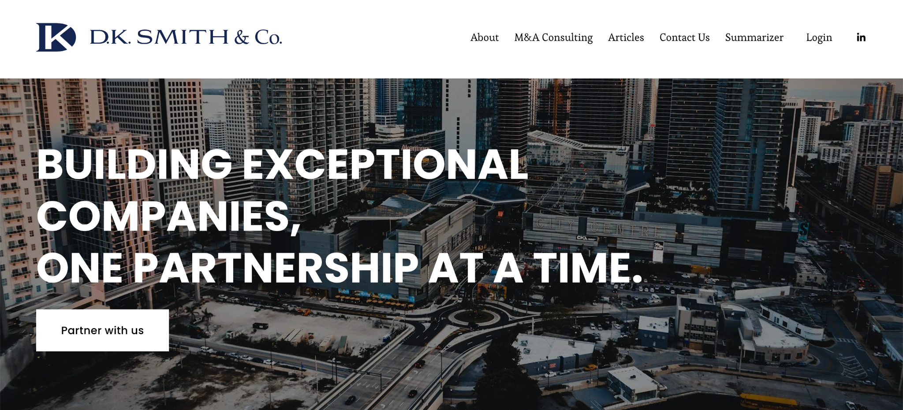
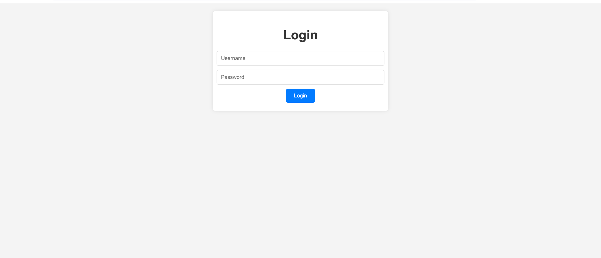
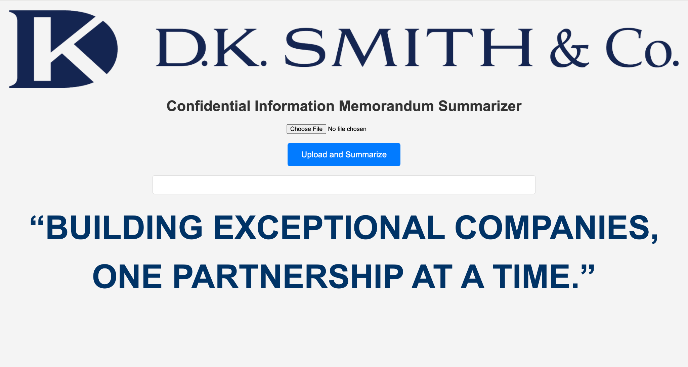
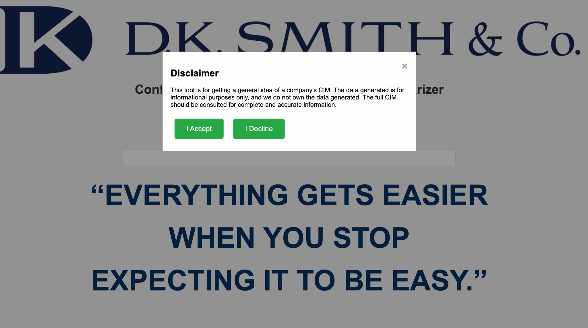
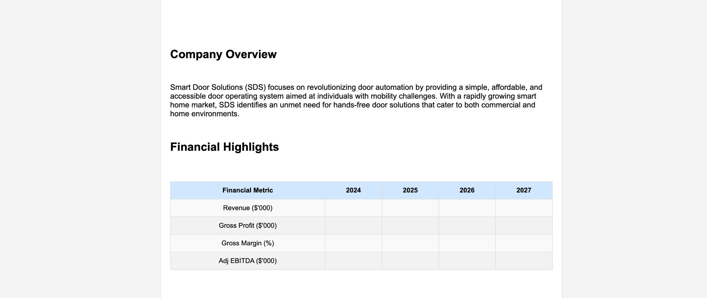
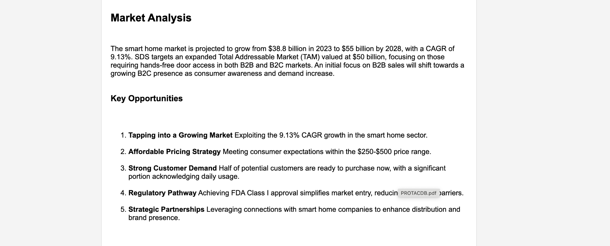
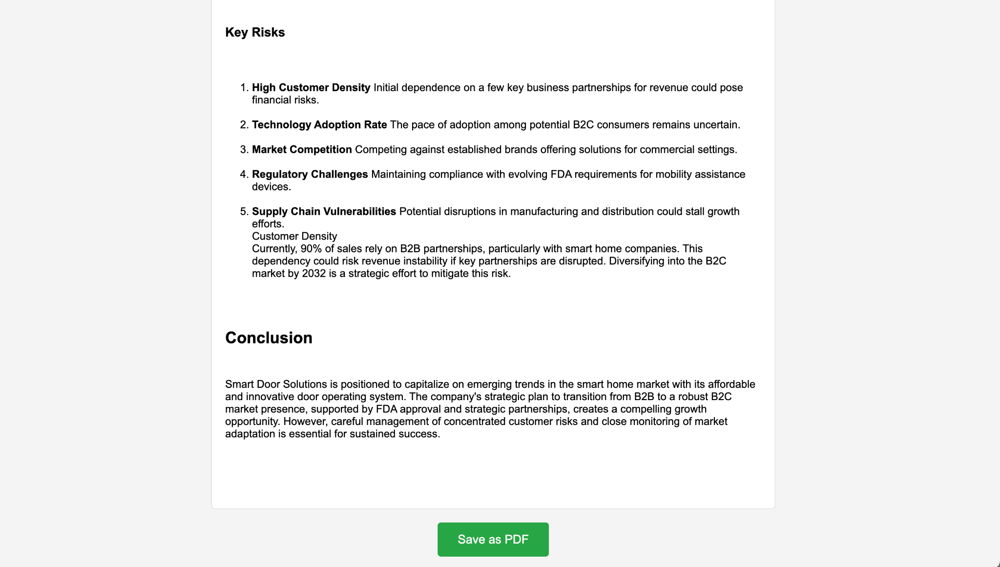

# CIM Summarizer — DK Smith & Co. (Public Showcase)

> Upload a **Confidential Information Memorandum (CIM)** and receive a clear, structured one-pager: **Company Overview, Financial Highlights, Market Analysis, Key Opportunities, Key Risks,** and a short **Conclusion**. Built for faster triage during deal flow.

[Live Site](#) <!-- add Squarespace URL --> · [Privacy & Disclaimer](#privacy--disclaimer) · [Contact](#contact)

---

  

## Table of Contents
- [What It Does](#what-it-does)
- [Quickstart](#quickstart)
- [Outputs & Sections](#outputs--sections)
- [Squarespace Integration](#squarespace-integration)
- [Screenshots](#screenshots)
- [FAQ](#faq)
- [Privacy & Disclaimer](#privacy--disclaimer)
- [Credits](#credits)
- [License](#license)
- [Contact](#contact)

---

## What It Does
- **Rapid triage:** Turn long CIMs into a **single-page brief** for partners/associates.
- **Consistent structure:** Every run follows the same headings so it’s easy to compare deals.
- **Actionable:** Surfaces **opportunities** and **risks** side-by-side, with space for edits.
- **Exportable:** **Save as PDF** for sharing internally or attaching to a pipeline record.

> This repository is **documentation only**. Production code and models are private.

---

## Quickstart
1. Open the **DK Smith & Co.** site and navigate to **Summarizer**.
2. **Log in** if required.
3. **Upload** a CIM (PDF/DOCX).
4. **Accept** the on-screen disclaimer.
5. Review the generated **one-pager** and click **Save as PDF**.

   
   
  

---

## Outputs & Sections
The generator builds a clean, scannable brief:

- **Company Overview** — what the business does, who it serves, and the core wedge.
- **Financial Highlights** — a table for Revenue, Gross Profit, Margin, Adj. EBITDA (by year).
- **Market Analysis** — market size/growth notes and competitive context.
- **Key Opportunities (1–5)** — growth levers, pricing/mix, go-to-market angles, regulatory tailwinds, etc.
- **Key Risks (1–5)** — concentration, competition, adoption, regulatory, supply chain.
- **Conclusion** — a short investment take to anchor discussion.
- **Export** — one-click **Save as PDF**.

   
   
  

---

## Squarespace Integration
This tool is embedded **directly inside a Squarespace site**, so the team can use it without switching apps.

**Implementation pattern (high-level):**
- **Custom Code Block / Code Injection** to mount the summarizer UI.
- **Authenticated endpoint** for file upload & processing (separate from Squarespace).
- **Server-side processing** renders the one-pager; the browser receives only the formatted result.
- **Optional gating** with a lightweight **login** before upload.

> If you need a deeper integration note (headers, reverse proxy, or single-sign-on), add it here once finalized.

---

## Screenshots
- `assets/cim-hero.png` — DK Smith & Co. home with **Summarizer** nav
- `assets/cim-login.png` — Login screen
- `assets/cim-upload.png` — Upload + Summarize
- `assets/cim-disclaimer.png` — Pre-run disclaimer modal
- `assets/cim-quote-1.png` — Loading splash (tree planting)
- `assets/cim-quote-2.png` — Loading splash (shade under tree)
- `assets/cim-quote-3.png` — Loading splash (community under tree)
- `assets/cim-output-overview.png` — Overview + Financials table
- `assets/cim-output-market.png` — Market + Opportunities
- `assets/cim-output-risks.png` — Risks + Conclusion + Save as PDF

---

## FAQ

**What file types work best?**  
PDF and DOCX CIMs with selectable text (not just scans). For scans, OCR quality will affect results.

**Does it store my documents?**  
By default, the showcase describes a **transient** processing flow for demos. Your production deployment can be configured to avoid persistent storage and to disable any training use.

**Is this investment advice?**  
No. It’s a drafting aid for internal review only. See the disclaimer below.

---

## Privacy & Disclaimer
- **Confidentiality:** Intended for **internal use** on third-party CIMs with appropriate permissions.
- **Security posture:** Documents are **processed server-side**; production deployments can be set to not retain uploads.
- **No PHI/PII required.**
- **Not investment advice:** Results are **informational** and **incomplete**. Always consult the full CIM and conduct independent diligence.

---

## Credits
- **Built by:** Joseph-Michael Schulz  
- **Partner:** DK Smith & Co.

## License
Documentation in this repository is released under the **MIT License**.  
The application and underlying models are private.

## Contact
Questions, partnerships, or enterprise deployment?  
**DK Smith & Co.** · joey@dksmithco.com 

---
